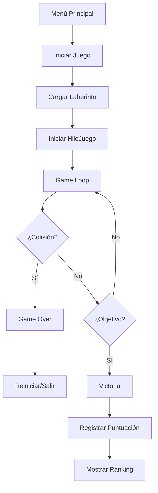

# 🍃 NARUTO LEGENDS - Juego de Laberinto Multihilo

[](https://www.oracle.com/java/)
[](https://docs.oracle.com/javase/tutorial/uiswing/)
[](https://netbeans.apache.org/)
[]()

> **Juego de laberinto desarrollado en Java** con arquitectura multihilo, sistema de colisiones avanzado y interfaz gráfica completa. Proyecto académico reconocido por su complejidad técnica.


## 🌟 Características Principales

- **🎯 Objetivo**: Rescatar a Hinata navegando por un laberinto complejo
- **⚡ Multithreading**: Gestión concurrente de múltiples entidades del juego
- **🎮 Controles Fluidos**: Movimiento con teclas WASD con KeyListener
- **💥 Sistema de Colisiones**: Detección precisa usando algoritmos de intersección
- **🏆 Sistema de Puntuaciones**: Registro y ranking de mejores tiempos
- **🎵 Audio Integrado**: Efectos de sonido y música de fondo
- **📊 Persistencia de Datos**: Almacenamiento en CSV con OpenCSV

## 🛠️ Tecnologías y Arquitectura

### Stack Tecnológico
- **Lenguaje**: Java SE 8+
- **GUI Framework**: Swing/AWT
- **Arquitectura**: Modelo-Vista-Controlador (MVC)
- **Concurrencia**: Multithreading con Thread y Runnable
- **I/O**: OpenCSV para persistencia de datos
- **Audio**: Java Sound API (javax.sound.sampled)

### Arquitectura del Sistema
```
📁 JuegoHil/
├── 📁 src/
│   ├── 📁 Controlador/          # Capa de Control
│   │   ├── HiloJuego.java       # Hilo principal del juego
│   │   ├── ManejadorLaberinto.java
│   │   ├── ManejadorMenu.java
│   │   └── ManejadorPuntaje.java
│   ├── 📁 Modelo/               # Capa de Datos
│   │   ├── Ganadores.java       # Entidad de ganadores
│   │   ├── RegistroGanadores.java
│   │   ├── LectorGanador.java   # Lectura CSV
│   │   └── EscritorGanador.java # Escritura CSV
│   └── 📁 Vista/                # Capa de Presentación
│       ├── FRM_Menu.java        # Menú principal
│       ├── FRM_Laberinto.java   # Ventana de juego
│       ├── Panel_Laberinto.java # Renderizado del laberinto
│       └── [Otros componentes GUI]
├── 📁 img/                      # Recursos gráficos
├── 📁 musica/                   # Archivos de audio
├── ArchivoGanadores.csv         # Base de datos de puntuaciones
└── build.xml                    # Configuración de build
```

## 🚀 Instalación y Ejecución

### Prerrequisitos
```bash
java -version  # Verificar Java 8 o superior
```

### Opción 1: Ejecutar desde NetBeans
1. **Clonar el repositorio**:
   ```bash
   git clone https://github.com/Bismarck767/juego-laberinto.git
   cd juego-laberinto
   ```

2. **Abrir en NetBeans**:
   - File → Open Project
   - Seleccionar la carpeta del proyecto
   - Ejecutar con F6 o Run Project

### Opción 2: Compilación Manual
```bash
# Navegar al directorio del proyecto
cd juego-laberinto

# Compilar con dependencias
javac -cp "lib/*" -d build src/**/*.java

# Ejecutar
java -cp "build:lib/*" Vista.FRM_Menu
```

### Opción 3: Usando el JAR (si está disponible)
```bash
java -jar JuegoLaberinto.jar
```

## 🎮 Cómo Jugar

### Controles
- **W, A, S, D**: Movimiento del personaje (Naruto)
- **Menú → Pausa**: Pausar/reanudar juego
- **Menú → Salir**: Terminar partida

### Objetivo
1. **Meta**: Llegar hasta Hinata (💜) en el centro del laberinto
2. **Obstáculos**: Evitar proyectiles enemigos (⚡) y NPCs (🔴)
3. **Puntuación**: Se mide por tiempo - mejores tiempos van al ranking

### Elementos del Juego
- 🟡 **Naruto**: Personaje jugador
- 💜 **Hinata**: Objetivo a rescatar
- 🟢 **Paredes**: Bloques del laberinto
- 🔴 **Enemigos**: NPCs que lanzan proyectiles
- ⚡ **Proyectiles**: Ataques enemigos en movimiento

## 🔧 Características Técnicas Avanzadas

### 🧵 **Sistema Multihilo**
```java
public class HiloJuego extends Thread {
    public void run() {
        while (!gameOver) {
            if (!frmLaberinto.isPausa()) {
                frmLaberinto.moverPersonaje();
                frmLaberinto.moverDisparo();
                frmLaberinto.detectarDisparo();
                frmLaberinto.detectarHinata();
            }
            sleep(120); // Control de FPS
        }
    }
}
```

### 💥 **Sistema de Colisiones**
```java
// Detección de colisiones con algoritmo de intersección de rectángulos
if (disparoX < (personajeX + jlPersonaje.getWidth()) && 
    (disparoX + ball.getWidth()) > personajeX &&
    (disparoY + ball.getHeight()) > personajeY && 
    disparoY < (personajeY + jlPersonaje.getHeight())) {
    // Colisión detectada
    hilo.gameOver = true;
}
```

### 🗺️ **Sistema de Laberinto**
```java
// Matrix-based maze system con validación de movimiento
public void moverPersonaje() {
    int[][] laberinto = panelD.obtnerlaberinto();
    int bloqueX = jlPersonaje.getX() / 60;
    int bloqueY = jlPersonaje.getY() / 60;
    
    if (estadoPersonaje.equals("subiendo")) {
        if (bloqueY > 0 && laberinto[bloqueY - 1][bloqueX] != 1) {
            jlPersonaje.setLocation(jlPersonaje.getX(), jlPersonaje.getY() - 60);
        }
    }
    // ... otros movimientos
}
```

### 📊 **Persistencia de Datos**
```java
// Sistema de guardado/carga con OpenCSV
public void escribir(ArrayList<Ganadores> arregloGanadores) {
    try {
        CSVWriter csvOutput = new CSVWriter(new FileWriter(nombreArchivo, false));
        csvOutput.writeAll(procesarClientes(arregloGanadores));
        csvOutput.close();
    } catch(IOException io) {
        io.printStackTrace();
    }
}
```

## 📁 Componentes Principales

### **🎮 HiloJuego.java**
- **Función**: Hilo principal que controla el game loop
- **Características**: Manejo de FPS, estado del juego, sincronización

### **🏗️ Panel_Laberinto.java**
- **Función**: Renderizado del laberinto usando Graphics2D
- **Características**: Sistema de matriz, colores 3D, optimización de dibujado

### **🎯 FRM_Laberinto.java**
- **Función**: Ventana principal del juego con KeyListener
- **Características**: Detección de eventos, control de audio, manejo de estados

### **📈 RegistroGanadores.java**
- **Función**: Gestión completa del sistema de puntuaciones
- **Características**: Sorting automático, límite de 10 mejores, validación de datos

## 🏆 Sistema de Puntuaciones

### Características
- **Top 10**: Solo se mantienen los 10 mejores tiempos
- **Ordenamiento**: Automático por mejor tiempo (ascendente)
- **Persistencia**: Datos guardados en `ArchivoGanadores.csv`
- **Validación**: Prevención de nombres duplicados

### Estructura CSV
```csv
"nombre","tiempo"
"bismarck","840"
"jorge","980"
"pele","540"
```

## 🎵 Sistema de Audio

### Archivos Soportados
- **Formato**: WAV (recomendado para compatibilidad)
- **Ubicación**: `/musica/` directory
- **Funciones**: 
  - Música de fondo en menú
  - Música durante gameplay
  - Control de volumen y pausa

### Implementación
```java
// Cargar y reproducir audio
sonidoFondo = AudioSystem.getClip();
sonidoFondo.open(AudioSystem.getAudioInputStream(
    getClass().getResource("/musica/Cancion.wav")
));
sonidoFondo.loop(Clip.LOOP_CONTINUOUSLY);
```

## 🐛 Resolución de Problemas

### Problemas Comunes

**❌ Error: "Cannot find main class"**
```bash
# Solución: Verificar CLASSPATH
java -cp "build:lib/*" Vista.FRM_Menu
```

**❌ Audio no reproduce**
```bash
# Verificar que los archivos WAV estén en /musica/
# Comprobar permisos de lectura
```

**❌ Lag en el juego**
```java
// Ajustar FPS en HiloJuego.java
sleep(120); // Cambiar valor según rendimiento
```

**❌ CSV no se guarda**
```bash
# Verificar permisos de escritura en directorio
# Comprobar que OpenCSV esté en classpath
```

## 🔄 Flujo del Juego



## 📚 Dependencias

### Incluidas en Java SE
- `javax.swing.*` - Interfaz gráfica
- `java.awt.*` - Componentes gráficos básicos
- `javax.sound.sampled.*` - Sistema de audio
- `java.io.*` - Entrada/salida de archivos

### Externas (en `/lib/`)
- **OpenCSV**: Manejo de archivos CSV
  ```xml
  <!-- Si usaras Maven -->
  <dependency>
      <groupId>com.opencsv</groupId>
      <artifactId>opencsv</artifactId>
      <version>5.7.1</version>
  </dependency>
  ```

## 🎯 Próximas Mejoras

- [ ] **Múltiples Niveles**: Sistema de niveles progresivos
- [ ] **Power-ups**: Objetos especiales en el laberinto
- [ ] **Multijugador Real**: Soporte para múltiples jugadores simultáneos
- [ ] **Editor de Laberintos**: Herramienta para crear laberintos personalizados
- [ ] **Mejores Gráficos**: Sprites animados y efectos visuales
- [ ] **Sistema de Vidas**: Múltiples intentos por partida
- [ ] **Configuración**: Opciones de dificultad y controles

## 🤝 Contribución

1. **Fork** el proyecto
2. **Crea** una rama para tu feature (`git checkout -b feature/NuevaCaracteristica`)
3. **Commit** tus cambios (`git commit -m 'Add: Nueva característica'`)
4. **Push** a la rama (`git push origin feature/NuevaCaracteristica`)
5. **Abre** un Pull Request

### Estándares de Código
- Seguir convenciones de nomenclatura Java
- Comentar código complejo
- Mantener arquitectura MVC
- Escribir tests para nuevas funcionalidades

## 📄 Licencia

Este proyecto está bajo la Licencia MIT. Ver [LICENSE](LICENSE) para más detalles.

## 👨‍💻 Autor

**Bismarck Talavera González**
- **Email**: [bismarcktalavera316@gmail.com](mailto:bismarcktalavera316@gmail.com)
- **LinkedIn**: [bismarck-talavera-gonzalez](https://www.linkedin.com/in/bismarck-talavera-gonzalez-a97841357)
- **GitHub**: [@Bismarck767](https://github.com/Bismarck767)

## 🙏 Agradecimientos

- **Profesor del curso**: Por el reconocimiento a la complejidad técnica
- **Comunidad Java**: Por recursos y documentación
- **NetBeans IDE**: Por facilitar el desarrollo GUI
- **OpenCSV**: Por simplificar el manejo de datos

---

## 📊 Estadísticas del Proyecto

- **Líneas de Código**: ~2,000+ líneas
- **Clases**: 15+ clases Java
- **Patrones**: MVC, Observer, Thread Pool
- **Tiempo de Desarrollo**: Proyecto académico semestral
- **Complejidad**: Alta (reconocida por instructor)

---

<div align="center">

**🌟 Si te gusta este proyecto, ¡dale una estrella en GitHub! 🌟**

**Desarrollado con ☕ y mucha dedicación por [Bismarck Talavera](https://github.com/Bismarck767)**

</div>

---

> *"Un proyecto que demuestra dominio de conceptos avanzados de programación: multithreading, arquitectura de software, manejo de eventos, y persistencia de datos. Ideal para mostrar habilidades técnicas sólidas."* - Evaluación Académica
